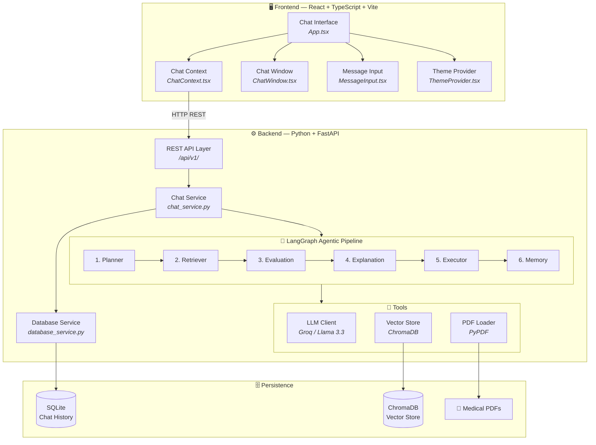
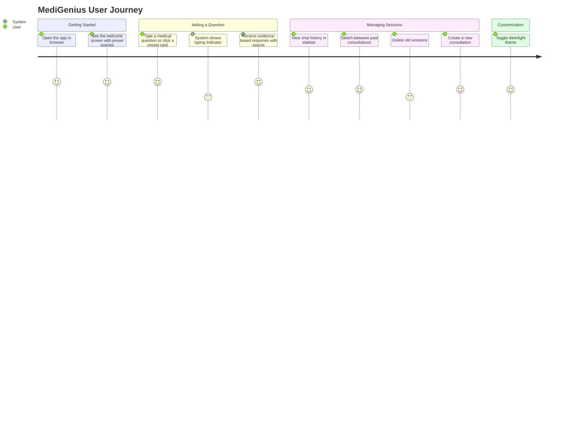

<div align="center">

# 🩺 MediGenius

### AI-Powered Medical Consultation Assistant

[](https://python.org)
[](https://fastapi.tiangolo.com)
[](https://react.dev)
[](https://langchain-ai.github.io/langgraph/)
[](LICENSE)

*An intelligent clinical consult agent that combines a 6-node LangGraph agentic pipeline with RAG-powered medical literature retrieval — delivering evidence-based, context-aware medical consultation through a sleek, responsive chat interface.*

[🚀 Quick Start](#-quick-start) · [📖 How It Works](#-how-it-works) · [🎬 Demo](#-demo) · [🏗️ Architecture](#️-architecture)

</div>

---

## 📋 Table of Contents

- [About the Project](#-about-the-project)
- [Demo](#-demo)
- [Key Features](#-key-features)
- [Architecture & Workflow](#️-architecture)
- [Tech Stack](#-tech-stack)
- [Folder Structure](#-folder-structure)
- [Quick Start](#-quick-start)
- [User Journey](#-user-journey)
- [API Reference](#-api-reference)
- [Future Extensions](#-future-extensions)
- [License](#-license)

---

## 🧠 About the Project

**MediGenius** is a full-stack, AI-powered medical consultation assistant that acts as a clinical consult agent. It ingests medical reference documents (PDFs) and builds a searchable vector knowledge base using **Retrieval-Augmented Generation (RAG)**. When a user asks a medical question, the system intelligently routes the query through a **6-node LangGraph agentic pipeline** — planning, retrieving, evaluating, explaining, executing, and memorizing — to deliver precise, evidence-backed medical advice.

The backend is built with **Python/FastAPI** and orchestrates the agentic workflow using **LangGraph** (a stateful graph framework for multi-step LLM applications). The frontend is a modern **React + TypeScript** SPA styled with **Tailwind CSS**, featuring a responsive dark/light theme, session management sidebar, and a premium chat interface.

### What Makes It Different?

| Traditional Chatbot | MediGenius Agentic Approach |
|---|---|
| Single LLM call, no context | 6-stage pipeline with planning, retrieval, and evaluation |
| No source verification | RAG from indexed medical literature with source attribution |
| Stateless conversations | Persistent session history with SQLite-backed memory |
| Generic responses | Medical keyword detection routes queries to specialized agents |

---

## 🎬 Demo

> Watch MediGenius in action — from asking about symptoms to receiving evidence-based medical consultation responses.

https://github.com/user-attachments/assets/2baf8578-b93a-4d35-9be0-5f7bf633d4c0

---

## ✨ Key Features

| Feature | Description |
|---|---|
| 🤖 **Agentic LangGraph Pipeline** | 6-node linear workflow: Planner → Retriever → Evaluation → Explanation → Executor → Memory |
| 📚 **RAG from Medical Literature** | Indexes PDF medical textbooks into a ChromaDB vector store for semantic retrieval |
| 🧭 **Query Classification** | Planner agent classifies queries using medical keyword detection (prepared for future dynamic routing) |
| 💾 **Persistent Chat Sessions** | SQLite-backed message history with full CRUD session management |
| 🌗 **Dark / Light Theme** | Toggle between themes with a single click; preference persists across sessions |
| 📱 **Responsive Design** | Mobile-first layout with collapsible sidebar navigation |
| ⚡ **One-Click Setup** | Unified `run.py` script auto-provisions venv, installs dependencies, indexes PDFs, and launches both servers |
| 🔍 **Source Attribution** | Every response cites its knowledge source (Medical Literature Database, AI Medical Knowledge, etc.) |

---

## 🏗️ Architecture

### System Architecture Overview



### Agentic Workflow — Step by Step

The heart of MediGenius is a **LangGraph StateGraph** that processes every user query through a deterministic, linear pipeline of 6 agent nodes:

```mermaid
flowchart LR
    START(["🟢 User Query"]) --> P

    P["🧭 <b>Planner</b><br/>Medical keyword<br/>detection"]
    R["📚 <b>Retriever</b><br/>ChromaDB vector<br/>search (RAG)"]
    EV["✅ <b>Evaluation</b><br/>LLM relevance<br/>scoring"]
    EX["💡 <b>Explanation</b><br/>Post-processing<br/>(reserved)"]
    E["⚡ <b>Executor</b><br/>LLM response<br/>synthesis"]
    M["💾 <b>Memory</b><br/>History trim &<br/>DB persistence"]

    P --> R --> EV --> EX --> E --> M --> END(["🔵 Response"])

    style START fill:#10b981,stroke:#059669,color:#fff
    style END fill:#3b82f6,stroke:#2563eb,color:#fff
    style P fill:#f59e0b,stroke:#d97706,color:#fff
    style R fill:#8b5cf6,stroke:#7c3aed,color:#fff
    style EV fill:#06b6d4,stroke:#0891b2,color:#fff
    style EX fill:#64748b,stroke:#475569,color:#fff
    style E fill:#ef4444,stroke:#dc2626,color:#fff
    style M fill:#22c55e,stroke:#16a34a,color:#fff
```



| Node | Agent | Role |
|---|---|---|
| 1 | **Planner** | Scans the user's question for medical keywords (symptoms, conditions, treatments, body parts) and logs query classification (prepared for future dynamic routing). |
| 2 | **Retriever** | Queries the ChromaDB vector store with a context-enriched search (includes last 3 user messages). Filters out documents shorter than 50 characters. |
| 3 | **Evaluation** | Uses the LLM to assess whether retrieved documents are actually relevant to the user's question. Outputs `RELEVANT: Yes/No` with reasoning. |
| 4 | **Explanation** | Reserved for future post-processing logic (currently a pass-through). |
| 5 | **Executor** | Synthesizes the final patient-facing response. Uses retrieved documents + conversation history to generate a clear, caring 2–4 sentence medical response. Falls back to direct LLM or a safe system message if RAG fails. |
| 6 | **Memory** | Trims conversation history to the last 20 turns (prevents context overflow). Persists the assistant's response to SQLite via `DatabaseService`. |

---

## 🛠️ Tech Stack

### Backend

| Technology | Purpose | Why This Choice |
|---|---|---|
| **[FastAPI](https://fastapi.tiangolo.com)** | REST API framework | Async-first, auto-generated OpenAPI docs, Pydantic validation out of the box |
| **[LangGraph](https://langchain-ai.github.io/langgraph/)** | Agentic workflow orchestration | Stateful, graph-based pipeline with typed state passing between agent nodes |
| **[LangChain](https://python.langchain.com)** | LLM + RAG toolkit | Unified interface for embeddings, vector stores, document loaders, and LLM providers |
| **[Groq](https://groq.com) (Llama 3.3 70B)** | LLM inference | Ultra-low latency inference on open-source Llama 3.3; free tier available |
| **[ChromaDB](https://www.trychroma.com)** | Vector store | Lightweight, embedded vector DB with cosine similarity; zero infrastructure needed |
| **[HuggingFace Embeddings](https://huggingface.co)** | Sentence embeddings | `all-MiniLM-L6-v2` — fast, lightweight model ideal for semantic search |
| **[SQLAlchemy](https://www.sqlalchemy.org) + SQLite** | Chat history persistence | ORM-based CRUD; SQLite for zero-config, file-based storage |
| **[PyPDF](https://pypdf.readthedocs.io)** | PDF parsing | Pure Python PDF reader; splits medical textbooks into indexable chunks |
| **[Pydantic](https://docs.pydantic.dev)** | Request/response validation | Type-safe schemas for API contracts; auto-serialization |
| **[Uvicorn](https://www.uvicorn.org)** | ASGI server | Production-grade async server with hot-reload for development |

### Frontend

| Technology | Purpose | Why This Choice |
|---|---|---|
| **[React 18](https://react.dev)** | UI library | Component-based architecture with hooks for state and context management |
| **[TypeScript](https://www.typescriptlang.org)** | Type safety | Catches type errors at compile-time; improves developer experience & code quality |
| **[Vite](https://vite.dev)** | Build tool & dev server | Instant HMR, lightning-fast cold starts; modern ESM-based bundler |
| **[Tailwind CSS 4](https://tailwindcss.com)** | Utility-first CSS | Rapid prototyping, consistent design tokens, zero CSS file bloat |

---

## 📂 Folder Structure

```
MYMediGenius/
├── backend/                          # ⚙️ Python FastAPI Backend
│   ├── app/
│   │   ├── agents/                   # 🧠 LangGraph agentic workflow nodes
│   │   │   ├── __init__.py           #    — exports all agents
│   │   │   ├── planner.py            #    — query classification (medical keyword routing)
│   │   │   ├── retriever.py          #    — ChromaDB vector store retrieval (RAG)
│   │   │   ├── evaluation.py         #    — LLM-based relevance scoring of retrieved docs
│   │   │   ├── explanation.py        #    — reserved for post-processing (pass-through)
│   │   │   ├── executor.py           #    — final response synthesis via LLM
│   │   │   ├── memory.py             #    — history trimming + SQLite persistence
│   │   │   └── llm_agent.py          #    — direct LLM response (no RAG)
│   │   │
│   │   ├── api/                      # 🌐 REST API routing
│   │   │   └── v1/
│   │   │       ├── api.py            #    — router aggregator
│   │   │       └── endpoints/
│   │   │           ├── health.py     #    — GET  /api/v1/health
│   │   │           ├── chat.py       #    — POST /api/v1/chat, /clear, /new-chat
│   │   │           └── session.py    #    — GET/DELETE session & history endpoints
│   │   │
│   │   ├── core/                     # ⚙️ Configuration & orchestration
│   │   │   ├── config.py             #    — env vars, path constants
│   │   │   ├── state.py              #    — AgentState TypedDict definition
│   │   │   ├── langgraph_workflow.py #    — StateGraph builder & compiler
│   │   │   └── logging_config.py     #    — rotating file + console logging
│   │   │
│   │   ├── db/                       # 🗄️ Database setup
│   │   │   └── session.py            #    — SQLAlchemy engine & session factory
│   │   │
│   │   ├── models/                   # 📦 ORM models
│   │   │   └── message.py            #    — Message table (session_id, role, content, source)
│   │   │
│   │   ├── schemas/                  # 📝 Pydantic validation schemas
│   │   │   ├── chat.py               #    — ChatRequest / ChatResponse
│   │   │   └── session.py            #    — SessionResponse / MessageResponse
│   │   │
│   │   ├── services/                 # 🔄 Business logic layer
│   │   │   ├── chat_service.py       #    — orchestrates the LangGraph pipeline
│   │   │   └── database_service.py   #    — CRUD operations for chat history
│   │   │
│   │   ├── tools/                    # 🔧 External integrations
│   │   │   ├── llm_client.py         #    — Groq LLM singleton (Llama 3.3 70B)
│   │   │   ├── vector_store.py       #    — ChromaDB create/load/retrieve
│   │   │   ├── pdf_loader.py         #    — PDF parsing & chunking (512 chars, 128 overlap)
│   │   │   └── duckduckgo_search.py  #    — web search tool (placeholder)
│   │   │
│   │   └── main.py                   # 🚀 FastAPI app entrypoint + lifespan
│   │
│   ├── data/                         # 📄 Reference medical documents
│   │   └── medical_book.pdf          #    — source PDF for RAG indexing
│   │
│   ├── storage/                      # 💾 Persistent data (auto-generated, gitignored)
│   │   ├── chat_db/                  #    — SQLite database file
│   │   └── vector_store/             #    — ChromaDB embeddings
│   │
│   ├── logs/                         # 📋 Rotating log files (auto-generated)
│   ├── requirements.txt              # 📦 Python dependencies
│   └── pyproject.toml                # 🔧 Build config, tool settings
│
├── frontend/                         # 🖥️ React + TypeScript SPA
│   ├── public/                       #    — static assets & favicon
│   ├── src/
│   │   ├── App.tsx                   #    — root layout: sidebar + workspace
│   │   ├── ChatContext.tsx           #    — global state provider (sessions, messages)
│   │   ├── ChatWindow.tsx            #    — chat feed: message bubbles + presets
│   │   ├── MessageInput.tsx          #    — input area with send, attach, voice buttons
│   │   ├── ThemeProvider.tsx         #    — dark/light theme toggle with persistence
│   │   ├── Header.tsx                #    — app header component
│   │   ├── Footer.tsx                #    — bottom footer layout
│   │   ├── index.css                 #    — Tailwind base + custom styles
│   │   ├── main.tsx                  #    — React DOM entry point
│   │   └── assets/                   #    — images, icons, SVGs
│   │
│   ├── index.html                    # 📄 HTML shell with SEO meta tags
│   ├── package.json                  # 📦 Node.js dependencies & scripts
│   ├── vite.config.js                # ⚡ Vite bundler configuration
│   ├── tsconfig.json                 # 🔧 TypeScript compiler options
│   └── postcss.config.cjs           # 🎨 PostCSS + Tailwind plugin config
│
├── .env.example                      # 🔑 Sample environment configuration
├── run.py                            # 🚀 Unified one-click setup & launch script
├── LICENSE                           # 📜 MIT License
└── README.md                         # 📖 Project documentation (this file)
```

---

## 🚀 Quick Start

### Prerequisites

| Requirement | Version | Check |
|---|---|---|
| **Python** | 3.10+ | `python --version` |
| **Node.js** | 18+ | `node --version` |
| **npm** | 9+ | `npm --version` |
| **Git** | Any | `git --version` |

### Step 1 — Clone the Repository

```bash
git clone https://github.com/voidee07/MyMediAssist.git
cd MyMediAssist
```

### Step 2 — Configure Environment Variables

```bash
cp .env.example .env
```

Open `.env` and fill in your API keys:

```env
# MediGenius Configuration

# LLM Provider Key (Groq) — Get yours free at https://console.groq.com
GROQ_API_KEY=your_groq_api_key_here

# SQLite Chat History Database Connection URL
DATABASE_URL=sqlite:///./backend/database/medigenius.db
```

> **💡 Tip:** You only need a **Groq API key** to get started. Sign up at [console.groq.com](https://console.groq.com) — free tier includes generous usage limits.

### Step 3 — Run the Application

#### Option A: One-Click Launch *(Recommended)*

```bash
python run.py
```

This single command will automatically:

1. ✅ Create a Python virtual environment (`.venv`)
2. ✅ Install all backend Python dependencies
3. ✅ Install frontend Node.js packages
4. ✅ Parse and index the medical PDF into the ChromaDB vector store
5. ✅ Start the FastAPI backend on `http://localhost:8000`
6. ✅ Wait for backend health check, then launch the React frontend on `http://localhost:5173`

#### Option B: Manual Setup

<details>
<summary><b>Click to expand manual setup instructions</b></summary>

##### 1. Start the Backend

```bash
# Create and activate virtual environment
cd backend
python -m venv .venv

# Windows
.venv\Scripts\activate

# macOS / Linux
source .venv/bin/activate

# Install dependencies
pip install -r requirements.txt

# Start the FastAPI server
cd ..
python -m uvicorn backend.app.main:app --port 8000
```

##### 2. Start the Frontend

In a **new terminal** window:

```bash
cd frontend
npm install
npm run dev
```

</details>

### Step 4 — Open in Browser

Navigate to **[http://localhost:5173](http://localhost:5173)** to start your medical consultation.

---

## 👤 User Journey

A step-by-step walkthrough of how a user interacts with MediGenius:



### Detailed User Flow

1. **🏠 Landing Screen** — The user opens `http://localhost:5173` and is greeted with a clean, modern interface showing the MediGenius branding and **4 preset medical query cards**:
   - *"What are the symptoms and stages of Hypertension?"*
   - *"What is the mechanism of action of Ibuprofen?"*
   - *"Search the medical book for Asthma treatment guidelines"*
   - *"Explain the difference between Type 1 and Type 2 Diabetes"*

2. **💬 Asking a Question** — The user can either click a preset card or type a custom question into the input bar at the bottom. The input supports:
   - Multi-line input via `Shift + Enter`
   - Auto-growing textarea that expands with content
   - Send via `Enter` key or the send button

3. **⏳ Processing** — While the backend processes the query through the 6-agent pipeline, a smooth bouncing-dots typing indicator appears in the chat window.

4. **📨 Receiving a Response** — The assistant's response appears in a styled message bubble with:
   - Formatted text with **bold** highlighting
   - Source attribution (e.g., *Medical Literature Database*, *AI Medical Knowledge*)
   - Professional, caring tone in 2–4 sentences

5. **📂 Session Management** — The left sidebar shows all past consultation sessions. Users can:
   - Click to load any previous conversation
   - Delete sessions with the trash icon (appears on hover)
   - Start a fresh consultation via the **"New Consultation"** button

6. **🌗 Theme Toggle** — Click the sun/moon icon in the sidebar footer to switch between dark and light mode.

---

## 📡 API Reference

All endpoints are prefixed with `/api/v1`. The backend runs on `http://localhost:8000`.

| Method | Endpoint | Description | Headers |
|---|---|---|---|
| `GET` | `/health` | Service health check | — |
| `POST` | `/chat` | Send a message through the agentic pipeline | `X-Session-ID` |
| `POST` | `/clear` | Clear in-memory conversation state | `X-Session-ID` |
| `POST` | `/new-chat` | Create a new chat session | — |
| `GET` | `/history` | Retrieve chat history for a session | `X-Session-ID` |
| `GET` | `/sessions` | List all sessions with previews | — |
| `GET` | `/session/{id}` | Load a specific session | — |
| `DELETE` | `/session/{id}` | Delete a session and its messages | — |

<details>
<summary><b>Example: Send a chat message</b></summary>

```bash
curl -X POST http://localhost:8000/api/v1/chat \
  -H "Content-Type: application/json" \
  -H "X-Session-ID: my-session-123" \
  -d '{"message": "What are the symptoms of diabetes?"}'
```

**Response:**
```json
{
  "response": "The symptoms of diabetes include increased thirst, frequent urination, unexplained weight loss, fatigue, and blurred vision. Type 1 diabetes symptoms tend to develop quickly, while Type 2 symptoms may develop gradually over several years.",
  "source": "Medical Literature Database",
  "timestamp": "03:45 PM",
  "success": true
}
```

</details>

---

## 🔮 Future Extensions

As a personal project, the roadmap includes several exciting features:
- **Web Search Integration**: Integrate DuckDuckGo or Tavily API to fetch real-time medical updates/news when vector database retrieval falls short.
- **Dynamic Workflow Routing**: Utilize the Planner's classification output to dynamically branch execution (e.g. routing non-medical queries directly to the `LLMAgent` to bypass the retriever and evaluator for faster responses).

---

## 📜 License

This project is licensed under the **MIT License** — see the [LICENSE](LICENSE) file for details.

---

<div align="center">

**Built with ❤️ using LangGraph, FastAPI, and React**

*⚠️ MediGenius provides AI-generated medical information for educational purposes only. Always consult a qualified healthcare professional for clinical decisions.*

</div>
